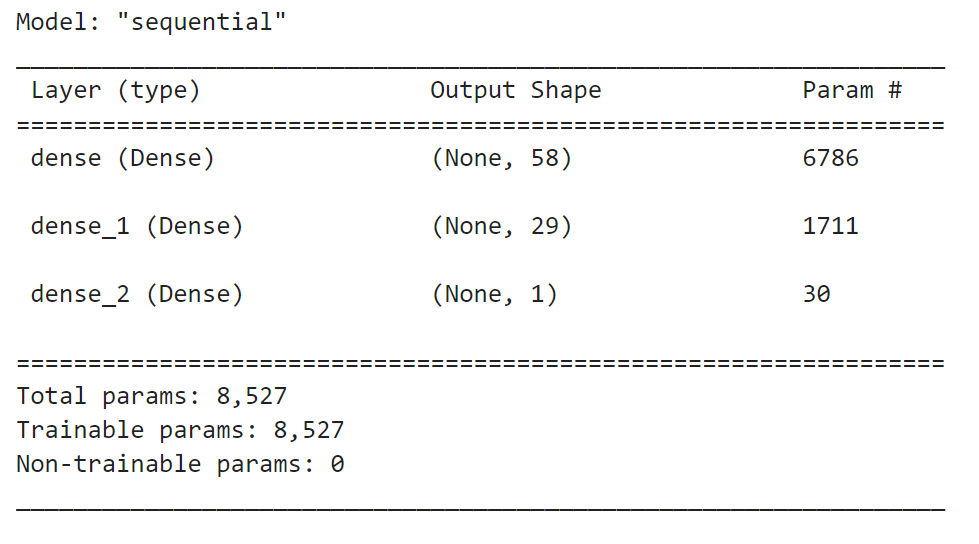
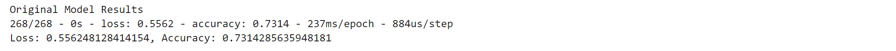
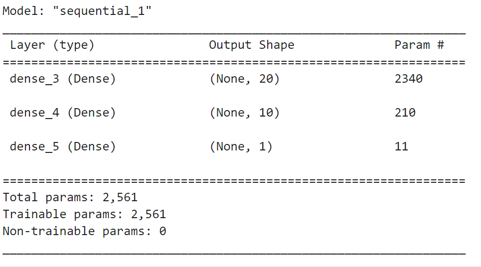
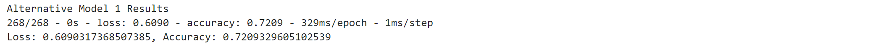
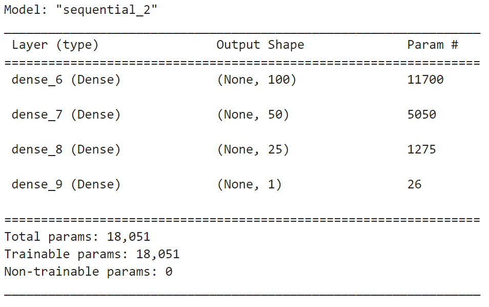
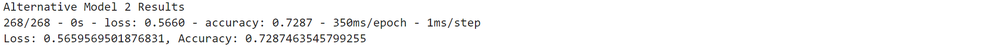

# Deep Learning Neural Network

The purpose of this challenge is to build a neural network to predict which of Alphabet Soup's startup investments will be most financially successful. You will compile a neural network model and test different parameters to determine the values that generate the most accurate model. You will then use the optimization techniques to enhance your data preprocessing and model design.

---

## Technologies

The credit risk resampling analysis leverages Python 3.8+ and utilizes the following project libraries and dependencies:
* [JupyterLab](https://jupyterlab.readthedocs.io/en/stable/) - a single integrated development environment (IDE) that allows you to write and run Python programs and review the results in one place
* [Pandas](https://pandas.pydata.org/) - a software library designed for open source data analysis and manipulation
* tensorflow
* pathlib
* sklearn - train_test_split
* sklearn - StandardScaler
* sklearn - OneHotEncoder

---

## Installation Guide

Download Anaconda for your operating system and the latest Python version, run the installer, and follow the steps. Restart the terminal after completing the installation. Detailed instructions on how to install Anaconda can be found in the [Anaconda documentation](https://docs.anaconda.com/anaconda/install/).

---

## Usage
The analysis is hosted on the following GitHub repository at: https://github.com/nguyenthuyt/deep_learning   

### **Run instructions:**
To run this analysis, simply clone the repository or download the files and open the **venture_funding_with_deep.ipynb** in Jupyter Lab.
___
## Results

* Deep Learning Model 1 (Original Data):

* Deep Learning Alternative 1 Model:

* Deep Learning Alternative 2 Model:

---

## Contributors

This project was created as part of the Rice Fintech Bootcamp 2022 Program by:

Thuy Nguyen

Email: nguyen_thuyt@yahoo.com

LinkedIn: nguyenthuyt

---

## License

MIT

